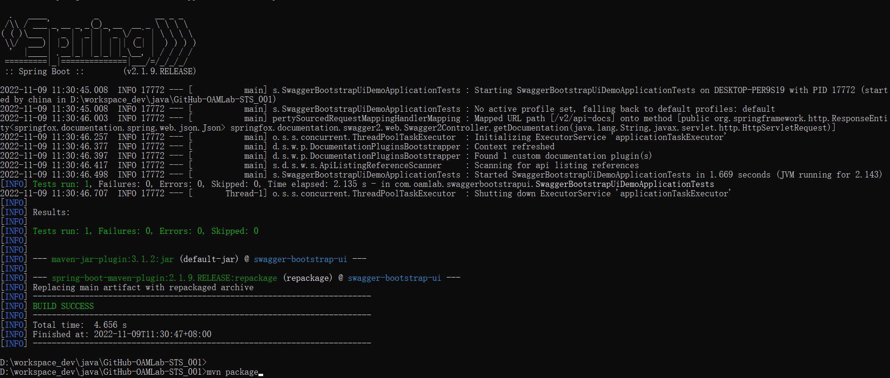
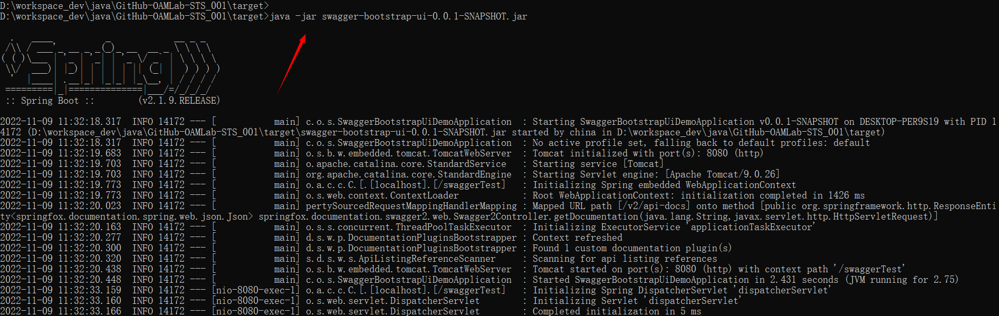
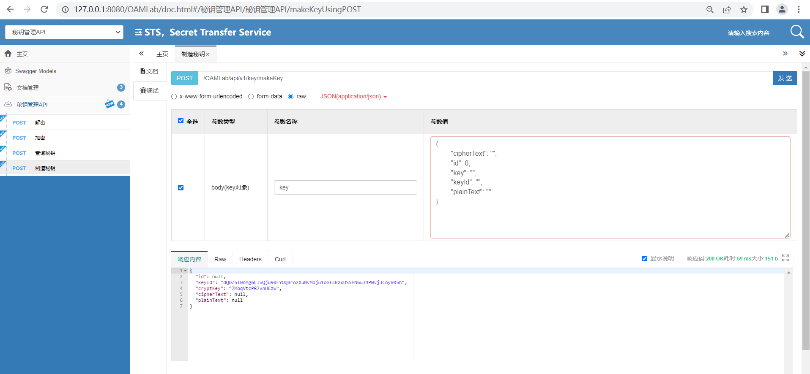
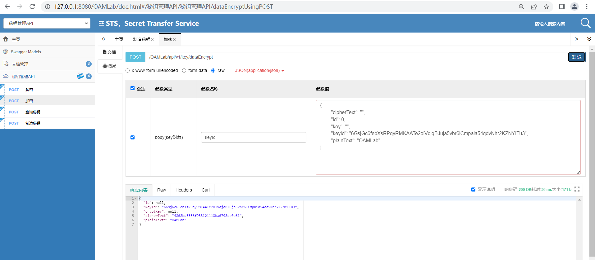

<h1 align="center" style="margin: 30px 0 30px; font-weight: bold;">STS v0.1.0</h1>
<h4 align="center">Secret Transfer Service</h4>
<p align="center">
  <a href="./LICENSE"></a>
  
</p>

<p align="center">
   <a href="https://github.com/oamlab/STS">github</a> | 
   <a href="https://gitee.com/oamlab/STS">gitee</a> | 
   <a href="./README.English.md">English</a>
</p>

<p align="center"></p>

---

## 🌏 Preface
- [在线文档：https://github.com/oamlab/STS](https://github.com/oamlab/STS)
- [Online Documentation：https://github.com/oamlab/STS/](./README.English.md)

## 🔒 Background
- Solve the encryption requirements of confidential passwords of business environment configuration items. For example, the management configuration items of a certain system platform have the problem of clear keys, which may result in the leakage of artificial keys in the daily management process.
- After the infrastructure platform of a project is deployed, a stress test needs to be performed from the interface to the DB.

## 🔑 Purpose
- **Scenario A:** It can be used to encrypt confidential configuration items in business environment, as follows:
- 1.The database administrator of a project's production environment creates a new database account A, password P
- 2.The database administrator in the production environment uses the STS interface to obtain the keyid, combined with the password P, and obtains the ciphertext XXX of the password P on the STS interface
- 3.The database administrator in the production environment distributes the ciphertext XXX and keyid to the project team members into the configuration items of the business program, or into the ConfigMaps of the platform.
- 4.After the business program starts, send the ciphertext XXX and keyid to the STS interface to obtain the plaintext password P
- 5.The business program uses account A and password P to connect to the database.
- Notice:
- 1.It is required that only the production environment database administrator and business program host IP can access the STS, and other people and devices cannot access the STS interface;
- 2.You can also encrypt your account.
- 3.Theoretically, the leakage of the ciphertext XXX and keyid will not cause leakage, because the ciphertext cannot be decrypted without the STS.
- 4.The test environment can independently deploy a set of STS, which is different from the production environment.
-
-
- **Scenario B:** It can be used for interface testing and stress testing before the delivery of the infrastructure environment, as follows:
- 1.A project has newly deployed a kubernetes platform.
- 2.The tester deploys STS into kubernetes and starts 100 Pods, which connect to the same database.
- 3.The tester made a 10-minute interface request to create a secret key at a speed of 10,000 QPS, which will theoretically generate 6 million pieces of data.
- 4.The tester divides the actual number of data bars by 6 million to obtain the interface availability data and performance data.
- 5.During this process, the testers also observed the relevant load capacity data and charts of the host and platform such as CPU, memory, network, disk, etc.
- 6.The tester summarizes and generates a comprehensive report, and feeds back the load capacity of the kubernetes platform to the business department.

## 🔖 Basic profile
- Development language: JAVA
- Java_Version：1.8.0
- Key algorithm: SM4 encryption, symmetric encryption
- Interface type: RESTful
- Scope of use: within the scope of business projects, within the microservice cluster
- Access control: iptables restricts client IP range, nginx restricts client IP range
- High availability: database master-slave (master downtime cannot add keys, but does not affect query), interface HA+VIP

## 📃 Summary function pseudo code

``` java
def makeKey():
    key = random(Symmetric key X bits)
    sqlquery(conn,insert,key)
    keyId = sqlquery(conn,select,key)
    return keyId,key

def getKey(keyId):
    key = sqlquery(conn,select,keyId)
    return key

def encrypt(keyId,plaintext):
    ciphertext = algorithm(encrypt,plaintext,key=getKey(keyId))
    return ciphertext

def decrypt(keyId,ciphertext):
    plaintext = algorithm(decrypt,ciphertext,key=getKey(keyId))
    return plaintext

def healthy():
    healthyStatus = Math.abs(mysqlTimeStamp - javaTimeStamp)
    return healthyStatus
```
## 📑 To be improved

- **1.** At present, it is only to implement the envisaged functions, and the code structure needs to be further designed, and it can also be embedded in a more complete framework.
- **2.** It is recommended to deploy in the cluster, because the interface is not authenticated, and it does not seem to require authentication at present.
- **3.** URL filtering, character filtering, etc. to be added.
- **4.** The plaintext should be base64 encoded.
- **5.** To be further safety design.
- **6.** Exception capture, log (business log may not be recorded).
- **7.** others.

## 📰 other
- **1.** The database password, etc. in the project are handwritten and can be modified as needed.

## 📋 Test
``` java
Test address:
http://127.0.0.1:8080/OAMLab/doc.html

MakeKey: http://127.0.0.1:8080/OAMLab/api/v1/key/makeKey
{
	"cipherText": "",
	"id": 0,
	"key": "",
	"keyId": "",
	"plainText": ""
}

Encrypt: http://127.0.0.1:8080/OAMLab/api/v1/key/dataEncrypt
{
	"cipherText": "",
	"id": 0,
	"key": "",
	"keyId": "6GsjGc6febXsRPqyRMKAATe2olVdjqBJuja5vbr6lCmpaia54qdvNhr2KZNYITu3",
	"plainText": "OAMLab"
}

Decrypt: http://127.0.0.1:8080/OAMLab/api/v1/key/dataDecrypt
{
	"cipherText": "4808bd3336f933121118ba0798dc0a61",
	"id": 0,
	"key": "",
	"keyId": "6GsjGc6febXsRPqyRMKAATe2olVdjqBJuja5vbr6lCmpaia54qdvNhr2KZNYITu3",
	"plainText": ""
}

API health checkup: http://127.0.0.1:8080/OAMLab/api/v1/healthy
{
	"healthy": "1",
}
``` 

## 📶 Technical exchange club
(CN)SHENZHEN Operation And Maintenance CLUB, QQ group：216589280 [Click to join](https://jq.qq.com/?_wv=1027&k=tdDtDoUp)

## 🔨 Compile
<br>
<p align="center">
	
</p>

## 📡 Start STS
<p align="center">
	
</p>

## 🔧 Debug and Trial
<p align="center">
	
</p>

<p align="center">
	
</p>

<p align="center">
	
</p>

## 🔩 Performance_Testing
- Cloud platform:Kubernetes
- Number of containers(STS)：2
- Concurrency:200
- Total requests：20000
- [JMeter-Testing-profile](./Performance_Testing/301_Apache_JMeter_TestPlanA.20221114.1115.jmx)

<p align="center">
	
</p>

<p align="center">
	
</p>

<p align="center">
	
</p>

<p align="center">
	
</p>

## 🔃 Push Code
- Push code path: personal-branch >> develop >> main
- For example: develop_AndyYao_202301 >> develop >> main
- In order to facilitate code review, a maximum of 5 code files can be submitted each time, and a maximum of 200 lines of code can be submitted each time.
- [Connect to GitHub using SSH](https://github.com/oamlab/oamlab/blob/main/OAMLab/171_%E8%BF%90%E7%BB%B4%E5%B7%A5%E5%85%B7/301_%E5%BC%80%E5%8F%91%E5%B7%A5%E5%85%B7/211_GitHub_SSH_Key.md)

## About the License
- Original software or dependent software retains its original license.
- Codes, auxiliary software, usage methods, documents, etc. written independently of the original software or dependent software are authorized by the GNU General Public License v3.0 .
- For example: XXX Community Server 1.0.1 is authorized based on GPL v2.0, and the auxiliary software start_XXX.sh and documents we wrote are based on GPL v3.0 .